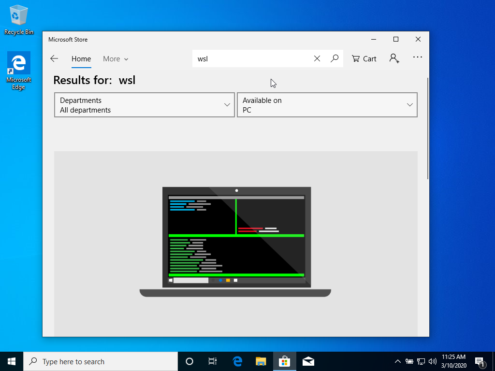
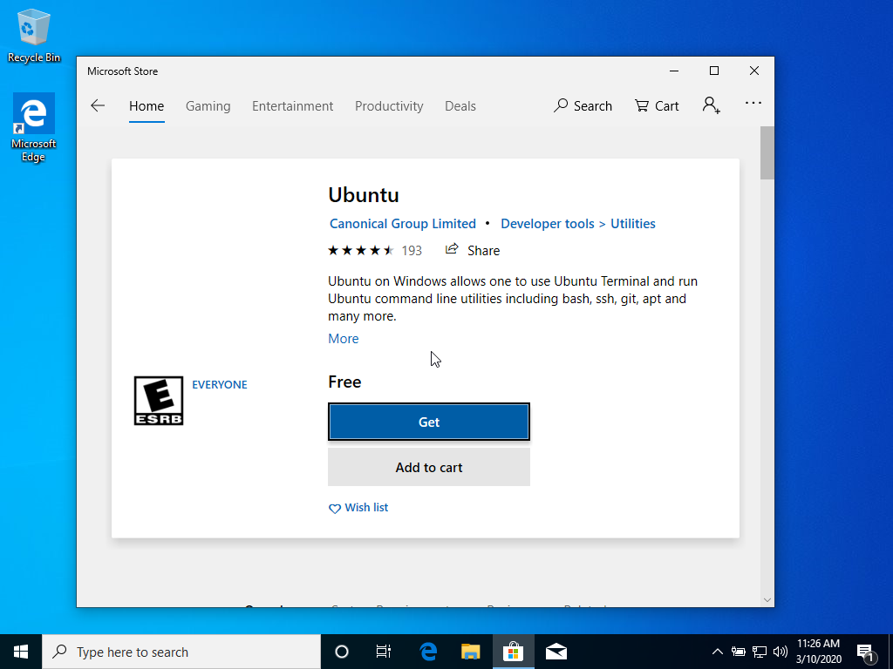
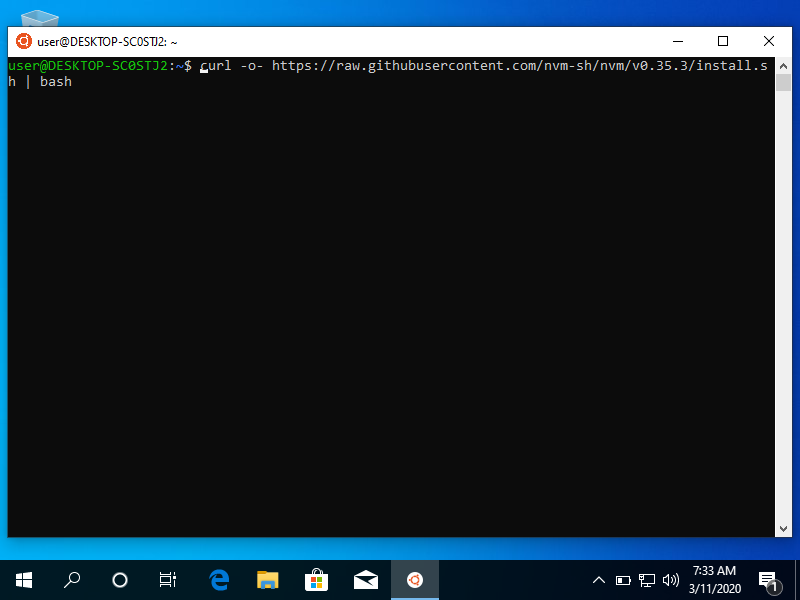
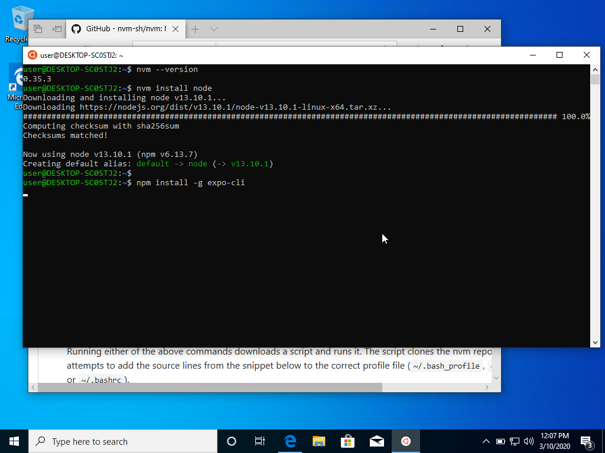

# Installing Expo on Windows

## WSL
The best way to install expo on windows is by first installing WSL (Windows
Subsystem for Linux).

1. Let's start by opening Microsoft Store and search wsl.
    
2. The first result will allow us to select Ubuntu.
    
    
3. Proceed to install it and launch it.
    
4. On launch it will open this website:
    
5. Following the instructions we need to run _Windows PowerShell_ as administrator
    
6. Run the command on the instructions will ask to reboot: write **Y**
    
    

7. We successfully installed WSL, on first open it will create the user and
   password for your Linux account.
    
    
    

## Node.js

To use node on our machine we will use nvm this will allow us to maintain
different versions of node if needed.
1. The best way to install it is by using the following command:

        curl -o- https://raw.githubusercontent.com/nvm-sh/nvm/v0.35.3/install.sh | bash

    
2. We'll have to restart our Ubuntu shell to use nvm.

    
3. To install node we simply run the command

        nvm install node
    

## Finally installing expo-cli

Using our installed version of Node we can now install expo.

        npm installl -g expo-cli

### Verifying and using with Visual Studio Code

- **The first time we open Visual Studio Code it will ask to install an
extension to use with WSL**

